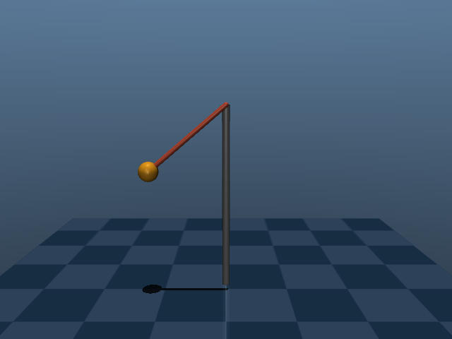
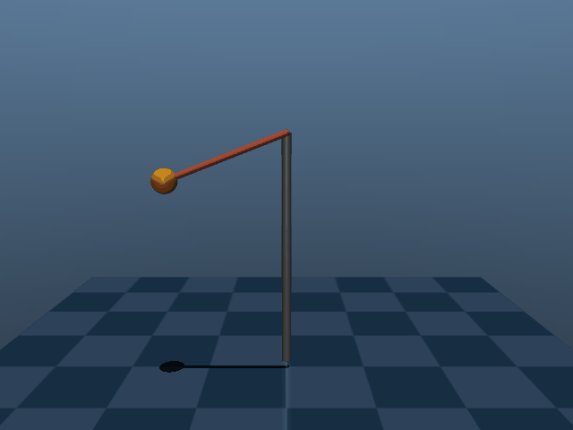
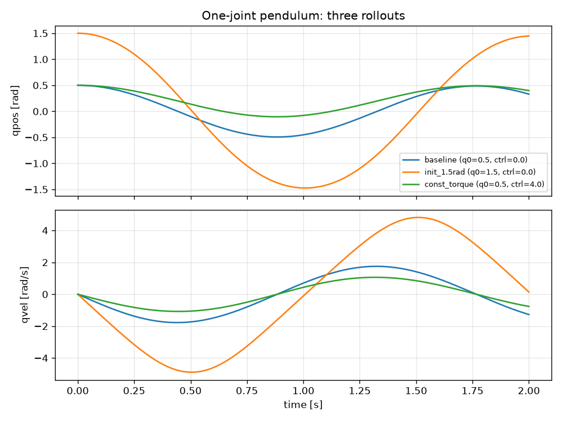

# MuJoCo Basics: One-Joint Pendulum

I built the smallest useful MuJoCo setup to learn how the simulation loop works: a single hinge joint (a pendulum hanging from a fixed post) driven by one `<motor>` actuator. `simulate.py` loads the MJCF model, builds the simulation state, steps the physics for about 2 seconds, and logs `time`, `qpos`, `qvel` and `ctrl` at each step. I run three rollouts with different initial conditions and control inputs to check that changing the inputs really changes the trajectory. The script can also open the interactive viewer or save a screenshot, a GIF and a plot.

## Setup

```bash
python3 -m venv .venv
source .venv/bin/activate
pip install -r requirements.txt      # or: pip install mujoco
```

Run it:

```bash
python simulate.py                    # 3 rollouts -> console + logs/rollout_<name>.csv
python simulate.py --render           # also writes media/one_joint.png, media/one_joint.gif, media/qpos_qvel.png
.venv/bin/mjpython simulate.py --viewer   # macOS: interactive viewer
python simulate.py --viewer           # Linux: plain python works
```

**Why `mjpython` on macOS:** the passive viewer (`mujoco.viewer.launch_passive`) has to render on the process's main thread, because macOS only lets the main thread drive the Cocoa event loop and windowing. A plain `python` script owns the main thread itself, so the viewer can't start. `mjpython` is installed with the `mujoco` package and works as a drop-in replacement for `python`: it keeps the main thread for the viewer and runs my script on another thread. On Linux this restriction doesn't exist.

## What I learned

### The simulation loop

MuJoCo splits a simulation into two objects:

- **`MjModel`**: the static description compiled from the MJCF file: bodies, joints, geoms, actuators, masses and options such as `timestep`. It doesn't change while the simulation runs.
- **`MjData`**: the mutable state: `time`, `qpos`, `qvel`, `ctrl`, plus everything MuJoCo computes from them (forces, contacts, body positions).

Each iteration: I write a control input into `data.ctrl`, call `mj_step`, and MuJoCo integrates forward one timestep to produce new `qpos`/`qvel`.

```
  one_joint.xml ──► MjModel (static)          MjData (mutable state)
                        │                 ┌──────────────────────────┐
                        │                 │ time, qpos, qvel         │
                        │                 └────────────┬─────────────┘
                        │                              │
                        │                 set data.ctrl (controller)
                        │                              │
                        └──────────────►  mj_step(model, data)
                                                       │
                                     time += timestep; new qpos, qvel
                                                       │
                                            log ──► repeat
```

The core loop in 8 lines:

```python
import mujoco
model = mujoco.MjModel.from_xml_path("mujoco/one_joint.xml")
data = mujoco.MjData(model)
data.qpos[0] = 0.5                      # initial angle (rad)
for _ in range(int(2.0 / model.opt.timestep)):
    data.ctrl[0] = 0.0                  # motor command
    mujoco.mj_step(model, data)         # advance one timestep
    print(f"{data.time:.3f} {data.qpos[0]:+.4f} {data.qvel[0]:+.4f}")
```

To start a new rollout from the same model, I call `mujoco.mj_resetData(model, data)`. It puts `time` back to 0, `qpos` back to the model's default pose (`qpos0`), and zeroes `qvel` and `ctrl`. `mujoco.mj_forward(model, data)` runs the same computation as `mj_step` (positions, forces, accelerations) but **does not integrate in time**. I use it after setting `qpos` by hand so derived quantities, such as body positions for rendering, are consistent before any step happens.

### The terms, practically

| Term | What it is | In this model |
|---|---|---|
| **`qpos`** | Generalized positions, size `model.nq`. | One hinge, so one number: the joint angle in **radians** (0 = hanging straight down). |
| **`qvel`** | Generalized velocities, size `model.nv`. | Angular velocity in **rad/s**. |
| **`ctrl`** | Actuator inputs, size `model.nu`. I write it; the actuators read it. | One motor: `data.ctrl[0]`. |
| **`timestep`** | Integration step, set in `<option timestep="...">` (MuJoCo's default is 0.002 s). | 0.002 s (500 Hz). |
| **actuator** | Maps `ctrl` to a generalized force on a joint. | `<motor gear="1" ctrlrange="-5 5">`. |

Notes:

- **`nq` vs `nv`:** for hinge and slide joints, one position matches one velocity, so `nq == nv`. A free joint stores its orientation as a quaternion (4 numbers) but its angular velocity as 3 numbers, so it has 7 `qpos` and 6 `qvel` entries and `nq != nv`. So `qpos` and `qvel` can't always be matched up index by index.
- **`ctrl` → torque:** for a `<motor>`, joint torque = `gear * ctrl`. With `ctrlrange="-5 5"` (and `ctrllimited`), any value outside the range is clamped, so writing `ctrl = 100` still gives only 5 N·m.
- **`timestep`:** one `mj_step` advances `data.time` by exactly one `timestep`, so `steps = seconds / timestep` (2 s / 0.002 s = 1000 steps). A smaller step is more accurate and stable but costs more steps per simulated second. A step that is too large can make stiff or fast systems blow up. My model uses the `RK4` integrator; MuJoCo's default is semi-implicit `Euler`.
- **Actuator types:**
  - `motor`: `ctrl` is a direct force or torque (scaled by `gear`).
  - `position`: `ctrl` is a target position; it acts as a PD-like servo with gain `kp`.
  - `velocity`: `ctrl` is a target velocity; it applies force proportional to the velocity error (gain `kv`).

## Experiment: changing the rollout

`simulate.py` runs the same 2 s simulation three times, using `mj_resetData` between runs, and changes one thing each time:

1. **baseline**: start at 0.5 rad, `ctrl = 0`. The pendulum swings freely and slowly loses energy to joint damping.
2. **init_1.5rad**: start at 1.5 rad, `ctrl = 0`. Same physics, different initial condition: a much larger swing.
3. **const_torque**: start at 0.5 rad with a constant `ctrl = 4.0` (4 N·m). The motor pushes the swing centre away from straight down.

The script compares the final states and confirms that each rollout ends somewhere different from the baseline. Results (from `logs/rollout_<name>.csv`):

| name | initial qpos (rad) | ctrl | final qpos (rad) | final qvel (rad/s) | mean qpos (rad) |
|---|---|---|---|---|---|
| baseline | 0.5 | 0.0 | 0.3297 | -1.2685 | 0.0508 |
| init_1.5rad | 1.5 | 0.0 | 1.4466 | 0.1386 | -0.0060 |
| const_torque | 0.5 | 4.0 | 0.3975 | -0.7626 | 0.2278 |

The final-qpos gap for `const_torque` looks small (0.07 rad) only because t = 2 s lands near a swing peak. The mean qpos (0.23 vs 0.05 rad) and the largest gap along the trajectory (0.39 rad) show the torque effect clearly.

## Media

Generated with `python simulate.py --render`.







## Files

- `mujoco/one_joint.xml`: MJCF model (one hinge, one motor, ground plane, light, explicit timestep).
- `simulate.py`: loads the model, runs the three rollouts, logs state, with optional `--viewer` and `--render`.
- `requirements.txt`: Python dependencies.
- `logs/rollout_<name>.csv`: per-step `time, qpos, qvel, ctrl` for each rollout.
- `media/`: screenshot, GIF and plot for this README.

## References

- MuJoCo Python bindings: https://mujoco.readthedocs.io/en/stable/python.html
- MJCF XML reference: https://mujoco.readthedocs.io/en/stable/XMLreference.html
- Computation / simulation pipeline: https://mujoco.readthedocs.io/en/stable/computation/index.html
