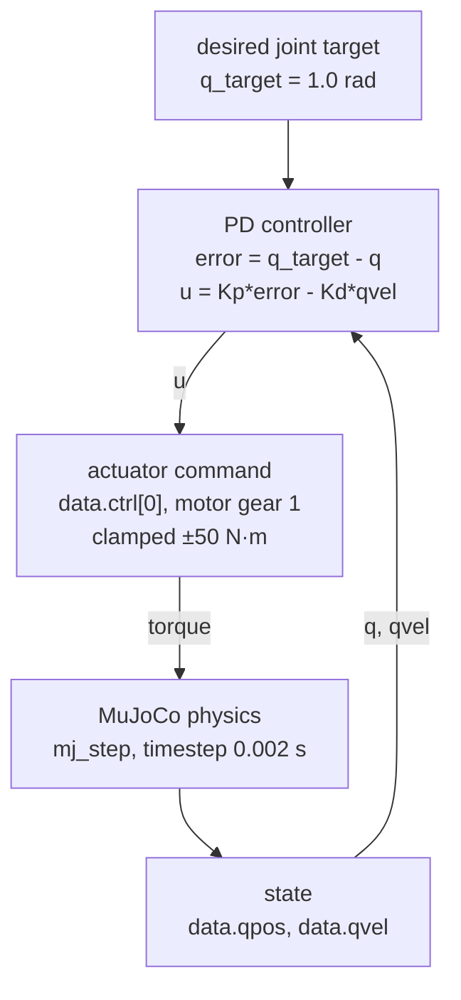
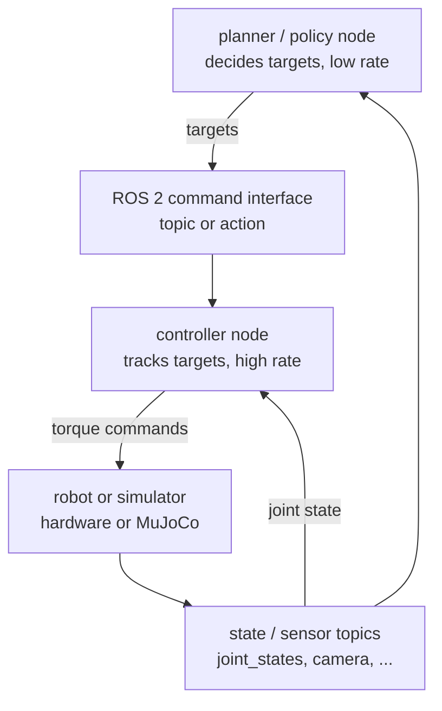

# Week 1 system map (Sunday)

Two pictures of the same idea: something decides what the joint should do,
something turns that into a motor command, physics moves the robot, and the new
state comes back. Diagram 1 is what I actually built this week; diagram 2 is
where it fits once there is a ROS 2 stack around it.

## 1. Simulation control loop (what I built)

```
                    q_target = 1.0 rad
                           │
                           ▼
              ┌──────────────────────────┐
              │ PD controller            │
              │ error = q_target - q     │◄──────────────┐
              │ u = Kp*error - Kd*qvel   │               │
              └────────────┬─────────────┘               │
                           │ u                           │
                           ▼                             │
              ┌──────────────────────────┐               │
              │ actuator: data.ctrl[0]   │               │
              │ motor, gear 1,           │               │
              │ clamped to ±50 N·m       │               │
              └────────────┬─────────────┘               │
                           │ torque                      │
                           ▼                             │
              ┌──────────────────────────┐               │
              │ MuJoCo physics: mj_step  │               │
              │ timestep 0.002 s (500 Hz)│               │
              └────────────┬─────────────┘               │
                           │                             │
                           ▼                             │
              ┌──────────────────────────┐    q, qvel    │
              │ state: qpos, qvel        ├───────────────┘
              └──────────────────────────┘
```



Who owns each box in this repo:

- **target**: `DEFAULT_TARGET = 1.0` in `mujoco/pd_control.py` (`--target` overrides it).
- **controller**: the loop inside `pd_rollout()` in `mujoco/pd_control.py` (observe, decide, act, step); gains live in the `GAINS` list.
- **actuator**: `<motor name="torque" gear="1" ctrlrange="-50 50">` in `mujoco/one_joint.xml`; MuJoCo does the clamping, I only write `data.ctrl[0]`.
- **physics**: `mujoco.mj_step(model, data)`, with `<option timestep="0.002" integrator="RK4">` in `one_joint.xml`.
- **state**: `MjData` (`data.qpos`, `data.qvel`, `data.time`); `MjModel` is the fixed description it is stepped against.

## 2. Future robot software stack

```
   ┌───────────────────────────┐
   │ planner / policy node     │◄───────────────────────┐
   │ decides targets, ~1-30 Hz │                        │
   └─────────────┬─────────────┘                        │
                 │ joint / pose targets                 │
                 ▼                                      │
   ┌───────────────────────────┐                        │
   │ ROS 2 command interface   │                        │
   │ topic or action           │                        │
   └─────────────┬─────────────┘                        │
                 ▼                                      │
   ┌───────────────────────────┐                        │
   │ controller node           │                        │
   │ tracks targets, ~500 Hz+  │                        │
   └─────────────┬─────────────┘                        │
                 │ torque / effort commands             │
                 ▼                                      │
   ┌───────────────────────────┐   ┌─────────────────────┴─┐
   │ robot or simulator        ├──►│ state / sensor topics │
   │ (hardware or MuJoCo)      │   │ joint_states, camera  │
   └───────────────────────────┘   └───────────────────────┘
          (the controller node also reads joint state)
```



**Who is responsible for what.** The planner or policy decides *what* the
robot should do next and produces targets at a low rate (a few to tens of Hz).
The controller decides *how* to make the joints get there and runs at a high
rate (hundreds of Hz or more), correcting every tick against fresh state. ROS 2
only moves messages between those processes; it is plumbing, not the
controller and not the policy. The robot hardware or the simulator is the
environment: it obeys physics, not my code.

**Where a learned policy goes.** A learned policy belongs in the planner/policy
box: it reads observations from the state and sensor topics and publishes
targets on the command interface. It should not replace the low-level
controller. The controller has to run fast, on time, every tick, and stay
predictable under limits and disturbances; my PD loop recovered from a kick in
0.15 s precisely because it re-checks the state every 2 ms. A network running at
10 Hz cannot do that, is hard to bound, and if it outputs garbage the
controller and torque limits are what keep the hardware safe.

## 3. How the two connect

Diagram 1 is the bottom half of diagram 2. The PD loop in `pd_rollout()` becomes
the controller node; `data.qpos`/`data.qvel` become a joint-state topic it (and
the policy) subscribe to; and the hard-coded `q_target` becomes a command topic
or action goal that the planner or policy publishes, while `mj_step` is the
"robot or simulator" box.

## 4. Oral gate answers

**What is configuration space, and how is it different from workspace?**
C-space is the set of all configurations `q` of the whole robot, i.e. every
setting of its joints; it has a shape, e.g. one revolute joint lives on a
circle and a 2R arm on a torus. The workspace is the set of end-effector poses
the robot can reach, so it is about the tool, not the whole body. Many
configurations can give the same tip position (elbow up vs elbow down), so the
two are not the same space.

**What does degree of freedom mean for a robot?**
DoF is the dimension of the C-space: the minimum number of numbers needed to
pin down the configuration. A free rigid body in 3D has 6; my pendulum has 1
(the hinge angle); a planar 2R arm has 2 (Grübler: 3(3 − 1 − 2) + 2). In
MuJoCo `nv` is the DoF count, while `nq` can be larger, like 7 for a free body
because the orientation is stored as a 4-number quaternion.

**What changes when a quantity is expressed in the world frame versus the robot/base/camera frame?**
The physical thing does not change, only the numbers I use to describe it,
because each frame has its own origin and axes. In my example the same point is
(0.1, 0.2, 0.8) in the camera frame, (0.6, −0.2, 0.2) in the base frame and
(2.2, 1.6, 0.2) in the world frame. To move between them I multiply by the
transform between the frames, and the subscripts must cancel (`p_a = T_ab p_b`).

**What is SO(3)? What is SE(3)? Why do we use a homogeneous 4x4 transform?**
SO(3) is the set of 3×3 rotation matrices: orthonormal (RᵀR = I) and
right-handed (det R = +1), so the inverse is just the transpose. SE(3) is
rotation plus translation, i.e. a full rigid-body pose. The 4×4 form
`[R p; 0 1]` with points written as `[p; 1]` turns `R p + t`, which is affine,
into one matrix multiply, so applying, chaining and inverting poses are all
plain matrix operations.

**If T_AB and T_BC are known, how do you get T_AC? How do you invert a transform?**
Multiply them: `T_AC = T_AB T_BC`; the inner B's cancel, and if they don't
match the product is a bug. To invert, I don't need a general matrix inverse:
`T_AB⁻¹ = T_BA = [Rᵀ  −Rᵀp; 0 1]`, i.e. un-rotate with Rᵀ and the old
translation becomes −Rᵀp. Both are `compose_transforms` and `inverse_transform`
in `math/transforms.py`.

**In MuJoCo, what are qpos, qvel and ctrl, and what happens during mj_step?**
`qpos` is the generalized position (my hinge angle in rad, 0 = hanging down),
`qvel` the generalized velocity (rad/s), and `ctrl` the actuator input I write
(for my motor, torque = gear × ctrl, clamped to ±50). `mj_step` reads the
current state and `ctrl`, computes forces (gravity, motor, joint damping) and
accelerations, and integrates forward one timestep (0.002 s, RK4), giving new
`qpos`, `qvel` and `time += 0.002`. All of it lives in `MjData`; `MjModel` is
the static description.

**Why did the closed-loop PD controller behave differently from a fixed/open-loop command?**
Open loop applied the 17.6 N·m that would hold the link at 1 rad, but it never
looked at `q`, so nothing removed the energy it picked up: it overshot by 385%
and swung over the top. The tuned PD (Kp = 500, Kd = 40) measured `q` and `qvel`
every step, so the error itself shaped the torque: 0% overshoot, settled in
0.30 s. After the 3 rad/s kick it was back within 5% in 0.15 s, because the
kick showed up as error and got pushed back; the open-loop torque never
changes, so it cannot react.

**What is the difference between a ROS node, topic, service and action?**
A node is one process doing one job (e.g. a controller or a camera driver). A
topic is a named one-way stream: publishers send, any number of subscribers
receive, nobody waits for a reply (joint states, images). A service is a
request/response call for something short (e.g. "reset", "get parameter"). An
action is for long-running goals: you send a goal, get feedback while it runs,
can cancel it, and get a final result (e.g. "move to this pose").

**Where should a learned policy live relative to ROS and the low-level controller?**
Above both: it is a node that subscribes to state and sensor topics and
publishes targets through a topic or action. ROS carries its messages; it is
not the policy. The low-level controller stays underneath, tracking those
targets at a high rate, because it has to be fast, predictable and safe under
torque limits and disturbances, which a slower learned model can't guarantee.

**Describe the complete observation -> decision/control -> action -> physics -> next-observation loop in your own words.**
First I read the state, `q` and `qvel` (in sim from `MjData`, on a robot from
encoders). The controller compares it with the target and computes a command,
`u = Kp*(q_target - q) - Kd*qvel`. That command goes to the actuator through
`data.ctrl`, where it is clamped to what the motor can do. Physics then
advances one 2 ms step with gravity, motor torque and damping, which produces a
new `q` and `qvel`, and the loop starts again from that new observation.

## 5. Week-1 review

- **What I learned:** C-space vs workspace and DoF counting; frames, SO(3),
  SE(3) and the subscript-cancelling rule, implemented in NumPy with tests; how
  MuJoCo splits `MjModel`/`MjData` and steps with `mj_step`; and how Kp and Kd
  trade speed, overshoot and gravity sag in a real closed loop.
- **What broke:** the viewer's post collided with the rod at first (fixed by
  moving it behind the swing plane and making it visual-only); `ctrlrange` ±5
  was too small for PD, since holding 90° needs about 21 N·m, so I widened it to
  ±50; the viewer closed after 30 s with no message (now runs until closed);
  the open-loop run flew over the top; and GitHub rejected my push over email
  privacy until I fixed the commit email.
- **What I can now explain:** compose and invert transforms by hand, trace
  qpos/qvel → controller → ctrl → physics, explain good vs bad PD gains with
  my own numbers, and say where policy, controller, ROS and physics each sit.
  Honest gap: the ROS 2 track (Saturday) is still a stub because it needs
  Ubuntu 24.04 + Jazzy, so my node/topic/service/action answers are from
  reading, not from inspecting a live graph yet.
- **What Week 2 adds:** forward and inverse kinematics, Jacobians, and a more
  deliberate controller for a simulated manipulator instead of one hinge.
