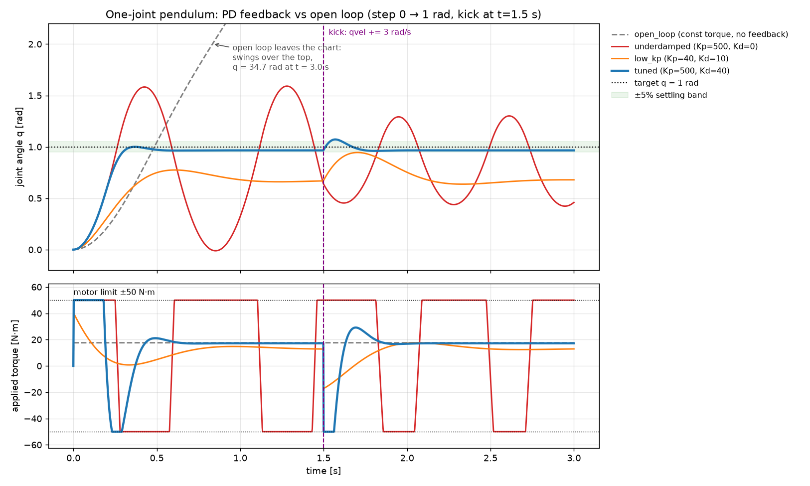

# Friday: PD control notes

Numbers come from `.venv/bin/python mujoco/pd_control.py`: a step from 0 to 1 rad, then a +3 rad/s kick at t = 1.5 s, with the motor limited to ±50 N·m.

The open-loop run applied the 17.6 N·m that holds the link at 1 rad, but it started from rest and nothing removed the energy it picked up, so it overshot by 385% and swung over the top (34.7 rad by t = 3 s). My deliberately bad setting, Kp = 500 with Kd = 0, reached the target band fastest (rise 0.25 s) but overshot by 59% and never settled. With no derivative term only the 0.05 joint damping removes energy, so the "spring" keeps trading angle for speed and the motor slams between +50 and -50 N·m. The other bad setting, Kp = 40 with Kd = 10, had no overshoot but sagged 0.34 rad short of the target, because plain PD only makes torque from error, so at rest Kp·error has to equal the gravity torque. To fix the oscillation I kept Kp = 500 and only added Kd = 40, which gave 0.0% overshoot, settling in 0.30 s and a leftover error of 0.034 rad (the same gravity sag, now small because Kp is large). So raising Kp made the response faster and shrank the steady-state error but caused ringing, and raising Kd removed the ringing at the cost of a slightly slower rise (0.28 s vs 0.25 s). After the kick, the tuned controller moved at most 0.11 rad and was back within 5% in 0.15 s, and low_kp also returned to where it had been, in 0.55 s. They recover because the controller measures q and qvel every step, so the kick shows up as error and gets pushed back, while the open-loop torque never changes and has no way to notice the disturbance.
